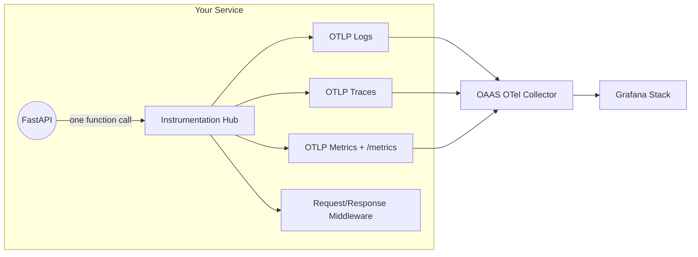

# Instrumentation Hub

An **OpenTelemetry Client Library**
- Add full observability (logs, traces, metrics) to any FastAPI service with a single function call.

### Why Instrumentation Hub?

- **One line to instrument.** Call `FastAPIInstrumentation().setup(app)` and your service gets structured logging, distributed tracing, HTTP metrics, and a Prometheus `/metrics` endpoint — all wired to [OAAS](https://github.com/vyavasthita/oaas).
- **Your service stays clean.** No OpenTelemetry boilerplate, no exporter setup, no log handler wiring. Observability is fully abstracted behind the library.
- **Sensitive data masking built in.** Request/response logging middleware automatically masks passwords, tokens, and configurable fields — safe for production from day one.
- **Backend routing via env vars.** Each service declares `LOGGING_BACKEND=loki`, `TRACING_BACKEND=tempo`, etc. The OAAS Collector routes accordingly — no code changes to switch backends.
- **Decoupled from infrastructure.** The library knows nothing about Grafana, Loki, or Prometheus. It pushes standard OTLP to whatever collector is on the Docker network.



**Example consumer:** [Auth Service](https://github.com/vyavasthita/auth-service)

---

## Packages

| Package | Framework | Status |
|---------|-----------|--------|
| [instrumentation-hub-fastapi](packages/python/fastapi) | FastAPI | Active |
| instrumentation-hub-django | Django | Planned |

---

## Configuration

- These env vars are set in the **consumer service's** `docker-compose.yaml` (not in this library).
- Endpoint values must point to the [OAAS](https://github.com/vyavasthita/oaas) OTel Collector on the shared Docker network.
- See [Auth Service](https://github.com/vyavasthita/auth-service) for a working example.

| Variable | Default | Description |
|----------|---------|-------------|
| `OTEL_SERVICE_NAME` | `instrumentation-hub-fastapi` | Service identity in telemetry |
| `OTEL_EXPORTER_LOGS_ENDPOINT` | `http://otel-collector:4318/v1/logs` | OTLP HTTP logs endpoint (OAAS Collector) |
| `OTEL_EXPORTER_TRACES_ENDPOINT` | `http://otel-collector:4318/v1/traces` | OTLP HTTP traces endpoint (OAAS Collector) |
| `OTEL_EXPORTER_METRICS_ENDPOINT` | `http://otel-collector:4318/v1/metrics` | OTLP HTTP metrics endpoint (OAAS Collector) |
| `LOGGING_BACKEND` | `loki` | Log routing hint for OAAS (`loki` / `opensearch`) |
| `TRACING_BACKEND` | `tempo` | Trace routing hint (`tempo` / `jaeger`) |
| `METRICS_BACKEND` | `prometheus` | Metrics routing hint |
| `METRICS_MOUNT_PATH` | `/metrics` | Prometheus exposition path |
| `ATTACH_PYTHON_LOGGING` | `true` | Attach OTEL handler to Python root logger |
| `LOG_LEVEL` | `INFO` | Python log level |

---

## Quick Start (FastAPI)

### 1. Install

```bash
poetry add git+https://github.com/vyavasthita/instrumentation-hub.git#subdirectory=packages/python/fastapi
```

### 2. Wire

```python
from instrumentation_hub_fastapi import FastAPIInstrumentation

app = FastAPI()
FastAPIInstrumentation().setup(app)
```

That single `.setup()` call configures: OTLP log/trace/metric exporters, FastAPI auto-instrumentation, request/response logging middleware with sensitive field masking, HTTP metrics (counters + histograms), and a Prometheus `/metrics` endpoint.

## Related Repositories

| Repository | Purpose |
|------------|---------|
| [OAAS](https://github.com/vyavasthita/oaas) | Observability stack this library pushes telemetry to |
| [Auth Service](https://github.com/vyavasthita/auth-service) | Working example — JWT auth service using this library |
| [Micro-mart](https://github.com/vyavasthita/micro-mart) | Working example — e-commerce microservices using this library |

---

## License

Copyright © 2026 Dilip Kumar Sharma. All rights reserved.
